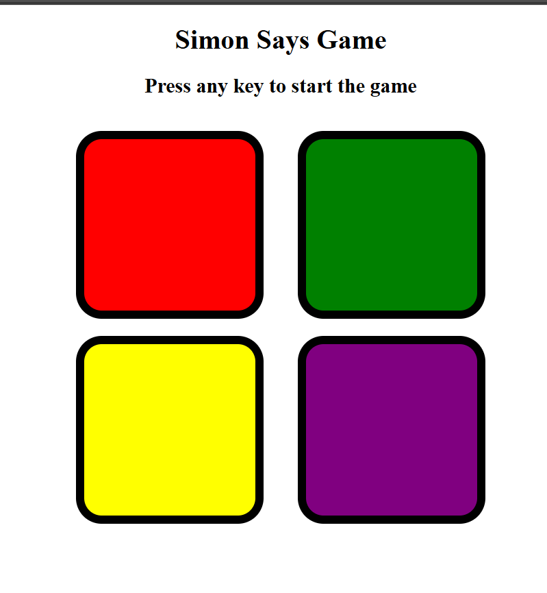

# Simon Says Game

A memory game built using HTML, CSS, and JavaScript.

## Features
- Random sequence generation
- Increasing difficulty
- Game over detection
- Button animations

## Concepts Practiced
Arrays, Functions, Loops, Event Listeners, DOM Manipulation

## Screenshot

